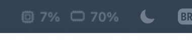

# MenuBarStats

> CPU, memória, disco, rede **e quanto ainda resta dos seus limites do Claude e do Codex**, tudo num clique na barra de menus do macOS.

<p align="center">
  
</p>

Quem programa com agentes de IA vive de olho em duas coisas: se a máquina está aguentando e se o limite do plano vai acabar no meio da tarefa. O MenuBarStats junta as duas no mesmo lugar. É um app nativo em SwiftUI, com poucas centenas de linhas e nenhuma dependência.

## O que ele mostra

**Na barra:** uso de CPU e de memória, com ícones que acompanham o tema claro ou escuro.

**Ao clicar:**

| Seção | Métricas | Atualização |
|---|---|---|
| Sistema | CPU · memória usada/total · disco livre · download/upload | a cada 2 s |
| Claude | Sessão (5h) e semana, em %, com o horário em que cada janela reinicia | a cada 5 min (ou no botão) |
| Codex | Sessão (5h) e semana, em %, com o horário em que cada janela reinicia | a cada 1 min |

As barras ficam laranja acima de 60% e vermelhas acima de 85%.

## Windows 10 e 11

**[Baixar para Windows x64 — versão beta](https://github.com/vicrmouz/menubar-stats/releases/download/windows-v0.1.0-beta.1/MenuBarStats-windows-x64.zip)**

Extraia a pasta inteira do ZIP e abra `MenuBarStats.exe`. O pacote inclui o runtime .NET e não exige instalação.

A versão Windows vive em [`windows/`](windows/README.md): CPU e RAM sobre a barra de tarefas, com painel ao clicar e a estética compacta da versão macOS. O pacote portátil x64 é gerado por `./windows/build.ps1` ou pelo workflow Windows do GitHub Actions.

A faixa pode ser arrastada e não reserva espaço no Explorer. A validação visual e a integração com a barra em Windows 10/11 ainda precisam ser executadas em uma máquina Windows; consulte a matriz em [`windows/README.md`](windows/README.md).

## Instalação macOS

Precisa de macOS 14+ e Swift 6 (as Command Line Tools bastam, o Xcode não é necessário).

```sh
git clone https://github.com/vicrmouz/menubar-stats.git
cd menubar-stats
./install-login-item.sh   # compila, instala em ~/Applications e abre no login
```

Só quer compilar, sem abrir no login? Rode `./build.sh` e abra `~/Applications/MenuBarStats.app`.

Para desinstalar:

```sh
launchctl bootout gui/$(id -u)/local.menubarstats
rm ~/Library/LaunchAgents/local.menubarstats.plist
rm -rf ~/Applications/MenuBarStats.app
```

## De onde vêm os números

Nada de scraping e nenhum login extra: o app só lê o que já existe na sua máquina.

- **CPU / memória:** APIs Mach do kernel (`host_processor_info`, `host_statistics64`). A memória segue o mesmo critério do Monitor de Atividade: apps + residente + comprimida.
- **Disco:** capacidade disponível do volume de inicialização, no mesmo critério do Finder.
- **Rede:** contadores de bytes das interfaces `en*` via `getifaddrs`, por diferença entre amostras.
- **Claude:** usa o token OAuth que o **Claude Code** já guarda no Keychain e consulta o mesmo endpoint de uso do comando `/usage`. O token nunca sai da sua máquina, exceto para a própria API da Anthropic.
- **Codex:** lê o evento `rate_limits` mais recente que o **Codex CLI** grava em `~/.codex/sessions/`.

## Limitações honestas

- O endpoint de uso do Claude **não é documentado** e pode mudar sem aviso. Se isso acontecer, a seção mostra "Sem dados".
- O Codex só grava os limites quando é usado: os números refletem a última sessão. Se a janela já reiniciou, o app mostra 0%.
- Em Mac com notch, o macOS esconde os itens da barra que não cabem. Por isso o rótulo é curto de propósito.

## Estrutura

```
Sources/MenuBarStats/
├── MenuBarStatsApp.swift   # MenuBarExtra, painel e rótulo com ícones
├── StatsModel.swift        # estado @Observable e agendamento das leituras
├── SystemReaders.swift     # CPU, RAM, disco e rede via APIs do sistema
└── UsageLimits.swift       # limites do Claude (API) e do Codex (arquivos locais)
```

## Notas de build sem Xcode

- `build.sh` usa `swift build --build-system native`: o build system novo do SwiftPM não inicializa só com Command Line Tools.
- Os macros do SwiftUI (`@State`) não vêm nas Command Line Tools, então o modelo é um `let` com `@Observable`.
- O `MenuBarExtra` não renderiza SF Symbols misturados com texto, então o rótulo é desenhado com `ImageRenderer` como imagem *template*.

## Licença

[MIT](LICENSE)
